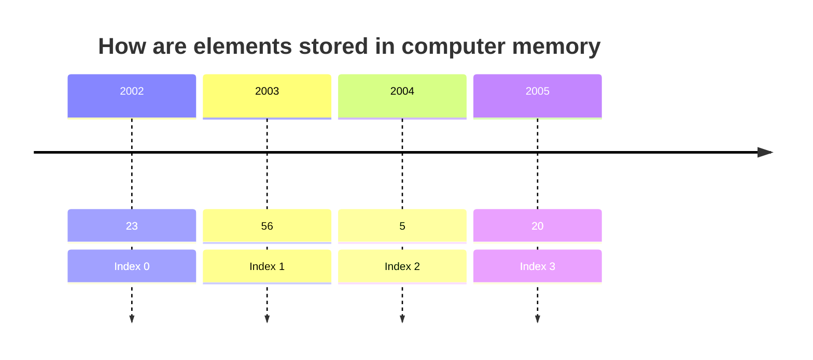

# Basic of Arrays

Array is a linear data structure where elements are stored in contiguous memory locations.

| Memory Address | 201 | 202 | 203 |
| -------------- | --- | --- | --- |
| Element        | 23  | 2   | 100 |
| Index          | 0   | 1   | 2   |

